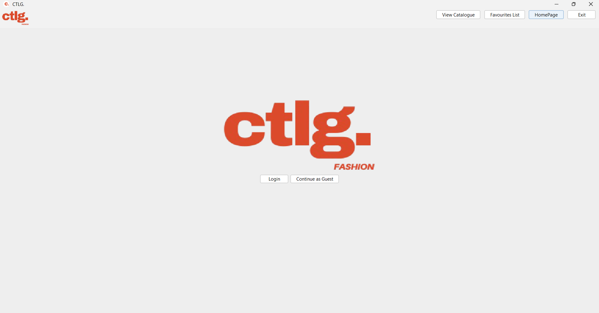
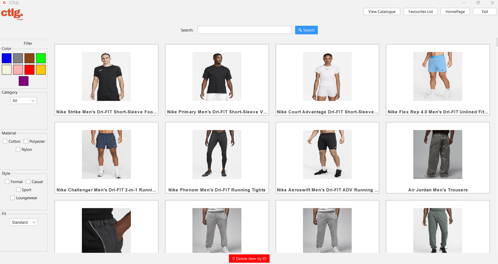

# CSCI-2040U-Project-2025

# CTLG.
## Project Overview
### Team Members:
Matthew Kassapian, Russell Manalo, Adrian Fudge, Mavrick Egan, Isabella Smith

## Table of Contents
- [Project Overview](#project-overview)
  - [Team Members](#team-members)
  - [Summary](#summary)
  - [High-level goals](#high-level-goals)
  - [Team Agreements and Elicitation Documents](#team-agreements-and-elicitation-documents)
- [Setup Instructions](#setup-instructions)
  - [1. Clone the repository](#1-clone-the-repository)
  - [2. Compile and run](#2-compile-and-run)
  - [3. Usage](#3-usage)
    - [Features](#features)
- [User Documentation](#user-documentation)
  - [Features](#features-1)
  - [How to Use](#how-to-use)
    - [Launching the app](#launching-the-app)
    - [Logging In](#logging-in)
    - [Browsing](#browsing)
    - [Filter](#filter)
    - [Searching](#searching)
    - [Favouriting Items](#favouriting-items)
    - [Admin Features](#admin-features)
      - [Adding/Editing/Deleting Items](#addingeditingdeleting-items)
- [Developer Documentation](#developer-documentation)
  - [Project Structure](#project-structure)
  - [Testing](#testing)
  - [Technologies Used](#technologies-used)
  - [Future Improvements](#future-improvements)


## Summary

**“CTLG.”** is a clothing catalogue application with access to a database of clothing from different brands. A user will be able to add or delete items from the catalogue, search for items, and apply various filters. This functionality ensures a tailored and efficient shopping experience, helping users discover clothing that matches their preferences and needs

Fashion and clothing has a big presence in culture, social media and in the market meaning that it will possess a large amount of users. Some key characteristics of our domain include:
1. Brands: A curated selection of both well-known and emerging clothing brands.
2. Colours: A versatile palette, from classic neutrals to bold, trendy hues.
3. Costs: A range of price points, from affordable everyday wear to premium designer pieces.
4. Materials: High-quality fabrics like cotton, polyester, linen, and sustainable options for comfort and durability.
5. Styles: Sporty, casual, formal, loungewear, and relaxed fits to suit every occasion and lifestyle.
6. Types of Clothing: A wide variety of garments, including shirts, sweaters, shorts, pants, dresses, jackets, and more.

### High-level goals:
1. High-Quality Product: The product functions and exceeds all requirements.
2. Friendly UI Design: The user interface is intuitive for all users.
3. Fast Access to Catalog: Reduce user waiting time.
4. Clean Data Files: CSV files are easily read with proper categorization.
5. Efficient Collaboration: Proper use of VCS, branching and communication.

### Team Agreements and Elicitation Documents
**Project Roles:**
- Project Manager: Isabella Smith
- Technical Manager: Adrian Fudge
- Front-End Lead: Matthew Kassapian
- Back-End Lead: Mavrick Egan
- Software Quality: Russell Manalo
- Developers: All

## Setup Instructions

### 1. Clone the repository

To get the source code, run the following command:

```bash
git clone https://github.com/JMatthewK/CSCI-2040U-Project-2025
cd CSCI-2040U-Project-2025

```
### 2. Compile and run

Compile the program:

```bash
mvn clean install
```

Finally, run the program:

```bash
java -jar target/FinalProject-1.0.jar
```

### 3. Usage

Once the program launches, the UI will display:



## User Documentation

#### Features

- View the full catalogue
- Add, delete and edit clothing items from the catalogue
- Filter items by various tags, and a search bar to find items by their name
- Make an account and save your favourite items

### How to Use
1. **Launching the app.**
2. **Logging In:** How to log into accounts.
3. **Browsing:** Scroll through the catalog.
4. **Filter:** Filter catalog using the menu.
5. **Searching:** Search through the catalog using search bar.
6. **Favouriting Items:** How to favourite items to your account.
ADMIN FEATURES
7. **Adding/Editing/Deleting Items:** How to modify items in the catalog.

## Developer Documentation

### Project Structure

CSCI-2040U-Project-2025/
├── .idea/                         # IntelliJ project settings
│   └── shelf/                     # Changes
│
├── data/                          # CSV files and UI image assets
│   ├── favorites/                 # Stores user-selected favorites
│   ├── img/                       # App image assets
│   ├── img_backup/                # Backup of image files
│   ├── accounts.csv               # User accounts data
│   ├── CatalogData.csv            # Primary catalog dataset
│   ├── CatalogDataBackup.csv      # Backup of catalog dataset
│   ├── CatalogDataForTesting.csv  # Test dataset for dev purposes
│   └── credentials/               # Stores login credentials in CSVs
│       ├── icon.png, icon2.png, newIcon.png # LOGO Icons
│
├── lib/
│   └── opencsv-4.0.jar            # External library for CSV parsing
│
├── out/                           # Compiled bytecode (auto-generated)
│   └── Account                    # Bytecode output of compiled classes
│
├── src/                           # Java source files
│   └── main/
│       └── java/
│           ├── Account.java              # Handles user account info
│           ├── CatalogApp.java           # Main class, starts the application
│           ├── CatalogController.java    # Manages logic between model and view
│           ├── CatalogViewer.java        # Java Swing UI code
│           ├── ClothingItem.java         # Data object for a clothing item
│           └── CsvParser.java            # Reads/writes CSV data
│
├── resources/                    # Fonts and UI assets
│   └── fonts/
│       └── ArchivoBlack-Regular.ttf     # Custom font for UI
│
├── catalog.png                   # UI screenshot (for README)
├── homepage.png                  # UI screenshot (for README)
├── dependency-reduced-pom.xml   
├── makefile                      # Optional Makefile (if used)
├── pom.xml                       # Maven build file
├── README.md                     
└── .gitignore                    # Git exclusions

### Testing
To run the tests for the application, use the following command
```bash
$ mvn test
```

### Technologies Used

- Java 17
- Java Swing (UI)
- Maven (Build Tool)
- CSV for data storage
- Git & GitHub (Version Control)

### Future Improvements
- Clothing recommendation algorithm
- User profile personalization
- Using remote database instead of local CSV files
